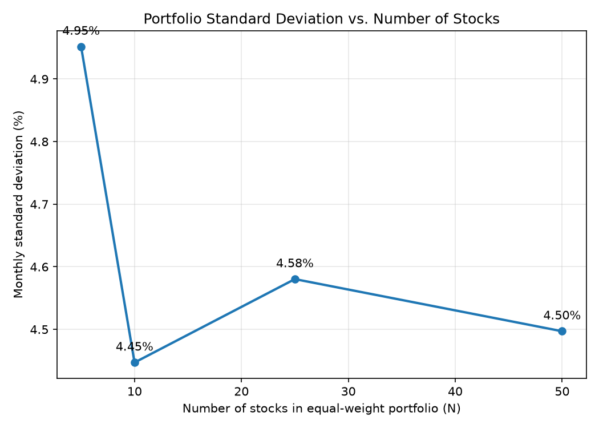

# Question 1(a): Diversification and Basic Statistics

## Equal-weight portfolio statistics

| N (stocks) | Sample Mean (monthly) | Sample Std Dev (monthly) |
|---|---|---|
| 5 | 1.6362% | 4.9518% |
| 10 | 1.6393% | 4.4471% |
| 25 | 1.5201% | 4.5803% |
| 50 | 1.5960% | 4.4970% |

## Standard deviation vs. number of stocks

## Notes

- Portfolios use a fixed alphabetical ticker ordering (first 5, first 10, first 25, first 50).
- Mean and standard deviation are computed on the equal-weight portfolio's monthly return series, using the sample (n-1) standard deviation.
