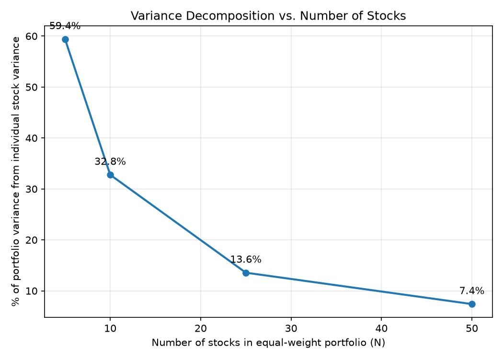

# Question 1(b): Variance Decomposition

## Decomposition of portfolio variance

| N | Avg. Stock Variance | Avg. Covariance | Portfolio Variance | Variance Contribution | Covariance Contribution | % from Variance |
|---|---|---|---|---|---|---|
| 5 | 0.007284 | 0.001244 | 0.002452 | 0.001457 | 0.000995 | 59.41% |
| 10 | 0.006481 | 0.001477 | 0.001978 | 0.000648 | 0.001330 | 32.77% |
| 25 | 0.007113 | 0.001889 | 0.002098 | 0.000285 | 0.001813 | 13.56% |
| 50 | 0.007485 | 0.001911 | 0.002022 | 0.000150 | 0.001873 | 7.40% |

## % of variance from individual stock variance vs. N

## Methodology notes

- Average covariance is backed out algebraically from Var(portfolio) = (1/N)·avg(variance) + ((N-1)/N)·avg(covariance), per the assignment's hint — the full pairwise covariance matrix is never computed directly.
- Variance and covariance contributions sum to total portfolio variance by construction.
