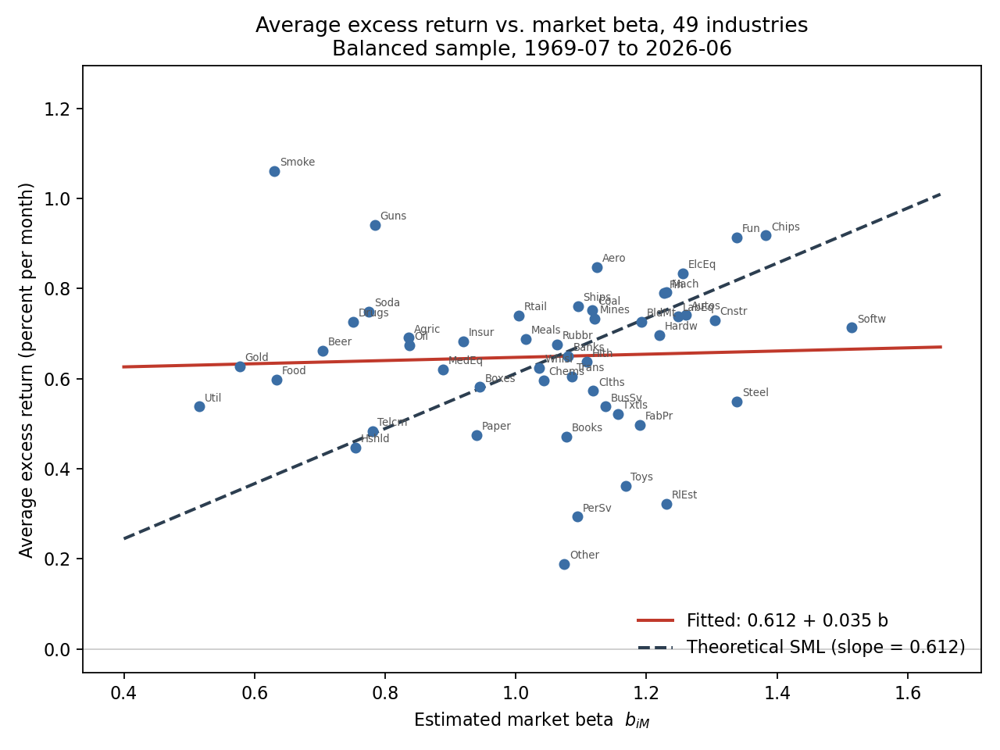

# Question 1(d): Average Return against Estimated Beta

**Figure 1.** Average excess return against estimated beta, 49 industry portfolios,
July 1969 – June 2026. Solid line: fitted cross-sectional regression. Dashed line:
theoretical SML.

Fitted line: $\overline{R_i} = 0.612 + 0.035\,b_{iM}$, with $R^2 = 0.002$.
Theoretical slope: 0.612, the sample mean of $R_M - R_f$.

## Does the plot resemble a positive relationship?

Barely. The fitted line is almost flat, and beta explains essentially none of the
cross-sectional variation in average returns. Low-beta industries such as Utilities,
Gold and Food earn about as much as high-beta industries such as Software, Chips and
Steel. The vertical scatter at any given beta is much wider than the variation
explained by beta itself. This is visible around $b_{iM} \approx 1.1$, where average
returns range from Other near the bottom of the chart to Ships and Coal near the top.

## What should the plot look like?

Under the CAPM the points should lie along an upward-sloping straight line. In
excess-return space that line passes through the origin, because a zero-beta portfolio
should earn no premium, and its slope should equal the average market excess return.
Deviations from the line should be small and unsystematic, because beta is supposed to
be the only characteristic that is priced.

## What the plot shows instead

The fitted line is far too high at $\beta = 0$ and far too shallow. It therefore
crosses the theoretical line near $\beta = 1$ and diverges from it in both directions.
This is the flat security market line, and it is the result from 1(b) shown
graphically: low-beta industries earn more than the CAPM predicts, and high-beta
industries earn less.

## AI Integration — SML prediction

We asked an LLM what a scatter of average returns against beta should look like under
the CAPM, what the most common empirical deviation is, and what explains it. It
answered that the points should lie on a straight line through the origin with slope
equal to the market premium, that the estimated line is typically too flat with a
positive intercept, and that this is explained by leverage constraints under Black's
zero-beta CAPM — citing Frazzini-Pedersen's "betting against beta" — and by omitted
risk factors such as size and value.

**(i)** The empirical SML is much flatter than the theoretical one. The fitted slope is
0.035 against a theoretical 0.612, and the intercept is 0.612 rather than zero. The LLM
predicted this direction correctly but understated the degree: it described a line that
still slopes upward, whereas our estimated slope is statistically indistinguishable from
zero.

**(ii)** It mentions all three. Its account of the leverage-constraint mechanism is
correct, and its second explanation anticipates the size and book-to-market tests in (e)
and (f). It does not mention errors-in-variables in the estimated betas, which produces
the same flattening for purely statistical reasons, or Roll's critique, under which a
flat line may indicate a poor market proxy rather than a failure of the model. The
response also referred to our industry results, so it was not predicting blind.

**(iii)** No. Beta explains almost none of the cross-sectional variation in average
returns, and industries with very different betas earn similar average returns.
Utilities and Software have the lowest and highest betas in the sample, yet their
average returns differ by little. The plot alone would not support the CAPM for these
industries.

## Robustness

The same plot for the full sample, July 1926 – June 2026, is saved as
`1d_sml_full.png`. The fitted slope is steeper (0.188 against a theoretical 0.695), but
still well below the theoretical value.

## Files

| File | Contents |
|---|---|
| `1_d_script.py` | generates both figures and the SML deviation rankings |
| `1d_sml.png` | Figure 1, balanced sample |
| `1d_sml_full.png` | full-sample version |
| `1d_llm_response.md` | full LLM response, condensed in the section above |
